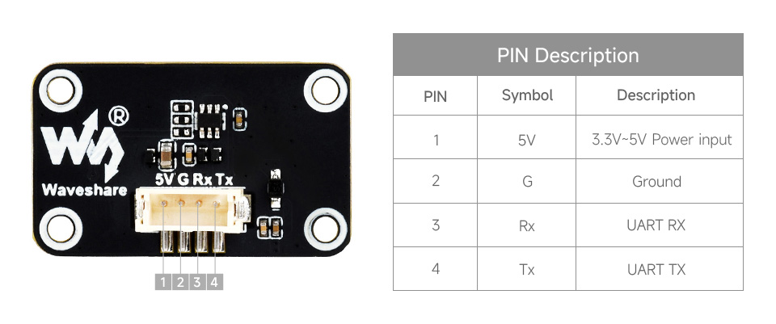

# signalk-10axis-ros-imu
get heading and attitude sensor data from Waveshare 10-axis ROS IMU (see [here](https://www.waveshare.com/10-dof-ros-imu-a.htm) and [WIKI](https://www.waveshare.com/wiki/10_DOF_ROS_IMU_(A))])

#### Supported SignalK data path

- self.navigation.attitude.roll
- self.navigation.attitude.pitch
- self.navigation.attitude.yaw (always zero)

- self.navigation.headingCompass
- self.navigation.magneticDeviation
- self.navigation.headingMagnetic -> (headingCompass + magneticDeviation)
